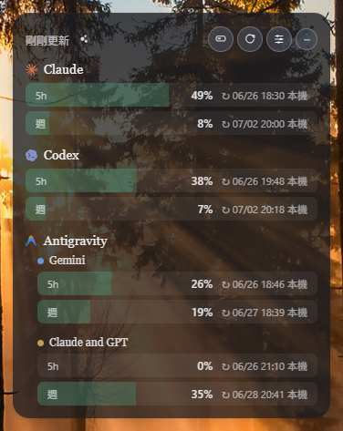
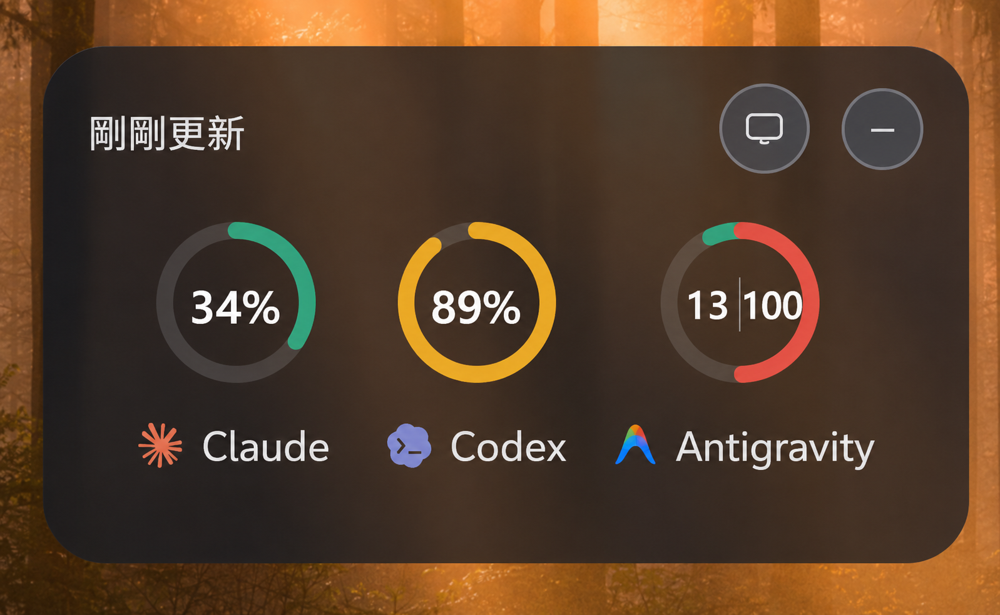
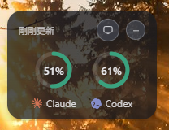
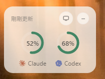
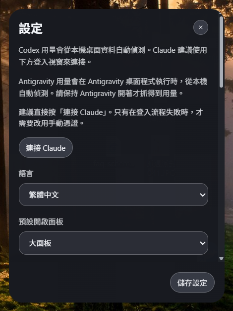
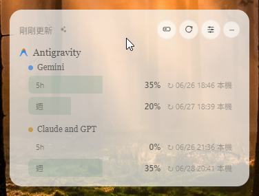
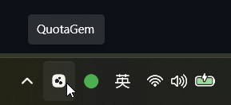

# QuotaGem

繁體中文 | [English](./README.en.md)


一個為 `Claude` 與 `Codex` 用量而生的 Windows 系統匣小工具。

它讓你不用一直打開網頁或切換分頁，就能在桌面上快速看到：

- 目前用量
- Session 與 Weekly 狀態
- 重設時間
- 警告與危險門檻



## 畫面預覽

### 精簡面板



### 單獨顯示 Claude 或 Codex

<p>
  
  
</p>

### 設定面板



### 淺色主題



### 系統匣圖示



## 你可以期待什麼

- 系統匣常駐，打開就看
- `expanded` 與 `compact` 兩種面板
- 同時查看 `Claude` 與 `Codex`
- 也可以單獨只顯示 `Claude` 或 `Codex`
- 自訂警告與危險門檻
- 背景通知提醒
- 可調整主題、透明度與縮放
- 內建 `Connect Claude` 流程

## 為什麼做這個

QuotaGem 想解決的是很簡單的一件事：

當你在高頻使用 AI 工具時，不應該等到額度快撞線了才發現。

它不是大型 dashboard，也不是複雜的管理平台。  
它比較像一顆安靜地待在桌面角落的小寶石，讓你隨時知道現在的使用狀態。

## 下載使用

前往 [Releases](https://github.com/gyozalab/QuotaGem/releases) 頁面，下載最新的 `QuotaGem-*.exe`，直接執行即可，免安裝。

## 開發者

```powershell
git clone https://github.com/gyozalab/QuotaGem.git
cd QuotaGem
npm install
npm run dev
```
