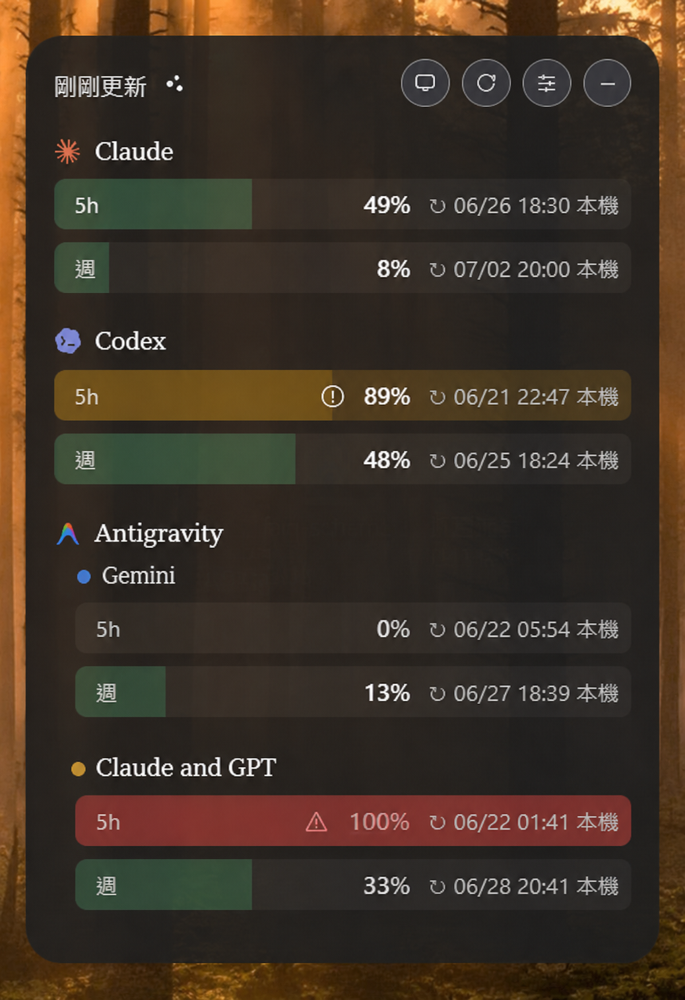
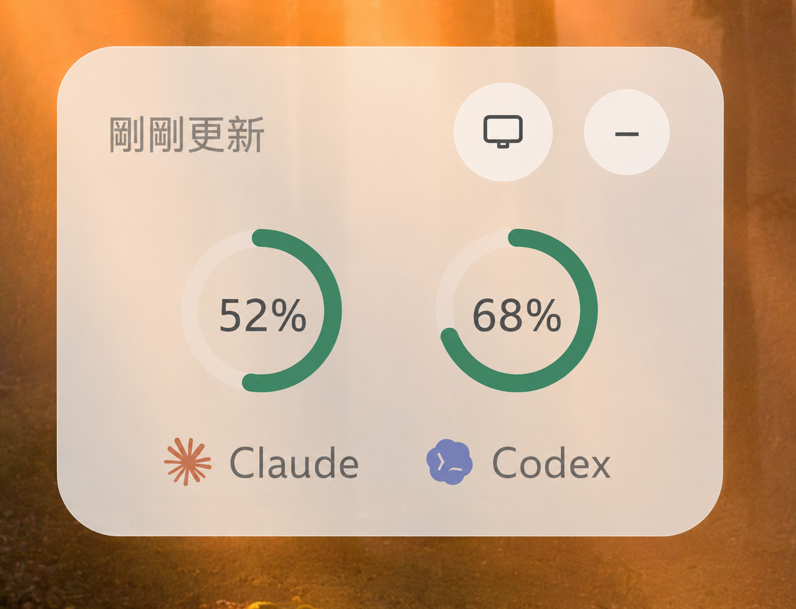

# QuotaGem

繁體中文 | [English](./README.en.md)


一個為 `Claude`、`Codex` 與 `Antigravity` 用量而生的 Windows 系統匣小工具。

它讓你不用一直打開網頁或切換分頁，就能在桌面上快速看到：

- 目前用量
- 五小時（Session）與每週（Weekly）狀態
- 重設時間
- 警告與危險門檻

## 2.0 有什麼新的

- 🆕 新增 `Antigravity` 第三 provider，自動拆成 `Gemini` 與 `Claude and GPT` 兩軌
- 🔄 精簡面板改成圓環設計，主顯五小時額度，每週用量收進 hover
- 🛡️ 單一實例保護，重複開啟或開機自啟都只會有一個視窗
- 📦 改用 Tauri 2 重寫，提供免安裝版，體積更小、更省記憶體
- 🚀 開機自啟會跟著目前執行的 `quotagem.exe` 路徑更新，搬動免安裝版後再開一次即可

## 畫面預覽

### 展開面板


### 精簡面板


### 用量警告與危險提醒



### 設定面板


### 淺色主題

<p>
  
  
</p>

### 系統匣圖示


## 支援的用量來源

- 系統匣常駐，打開就看
- `expanded` 與 `compact` 兩種面板
- 同時查看 `Claude`、`Codex` 與 `Antigravity`
- `Antigravity` 會分開顯示 `Gemini` 與 `Claude and GPT` 用量
- 也可以自由選擇只顯示其中一兩個
- 精簡面板直接顯示五小時額度，每週用量收在 hover 提示裡
- 自訂警告與危險門檻
- 背景通知提醒
- 可調整主題、透明度與縮放
- 開機自啟，跟著 Windows 一起醒來
- 繁體中文與英文介面切換
- 內建 `Connect Claude` 流程

透過內建 `Connect Claude` 流程取得必要 session 資訊，並用後端直接讀取 Claude 用量狀態。2.0 不再依賴隱藏瀏覽器視窗。

### Codex

讀取本機 `.codex/sessions` 中最新 session 紀錄，解析最後的 `token_count` 事件，顯示目前 rate limit 狀態。

### Antigravity

偵測本機已登入的 Antigravity language server，透過唯讀 RPC 取得額度摘要。QuotaGem 只讀取額度，不送出 prompt，也不消耗模型額度。

## 功能

- Windows 系統匣常駐，左鍵開關面板，右鍵顯示選單。
- `compact` 與 `expanded` 兩種面板。
- 三個 provider 可自由顯示或隱藏。
- 五小時與每週用量視覺化。
- 自訂 warning / danger 門檻。
- Windows 通知，可選全部通知或只通知危險狀態。
- 同一門檻跨刷新去重，避免重複提醒。
- 自動刷新與手動立即刷新。
- 深色與淺色主題。
- 透明度、縮放、時間格式與日期格式設定。
- 繁體中文與英文介面。
- 開機自啟，portable exe 搬動後重新執行即可更新啟動路徑。

底層用 Tauri（Rust + 系統內建 WebView2）打造，安裝檔個位數 MB、記憶體佔用低，常駐一整天也很安靜。

## 下載使用

前往 [Releases](https://github.com/gyozalab/QuotaGem/releases) 頁面，下載最新的免安裝版（`QuotaGem_*_x64-portable.zip`）。解壓縮後執行 `quotagem.exe`，需要跟著 Windows 啟動時，再到設定面板開啟開機自啟。

目前 Windows 發佈建議以免安裝版為主；安裝器會等程式碼簽章與 Microsoft Defender 誤判申訴穩定後再作為預設下載。開機自啟會指向目前執行的 `quotagem.exe` 路徑；如果你搬動 exe，從新位置執行一次即可更新 Windows 開機啟動項。

## 目前狀態

QuotaGem 2.0 的 Tauri 重寫已完成主要功能：三個 provider、展開與精簡面板、設定、告警、主題、語系、開機自啟、單一實例保護與免安裝版打包流程都已就緒。現階段建議優先發布 portable zip；MSI / NSIS 安裝器先保留為建置產物，等簽章與 Defender 誤判處理穩定後再升為預設下載。

```text
QuotaGem_2.0.0_x64-portable.zip
```

解壓縮後執行 `quotagem.exe`。若想讓 QuotaGem 跟著 Windows 啟動，可在設定面板開啟「開機自啟」。

目前請優先下載 zip 免安裝版；安裝器版本暫時不作為主要下載。

## 開發

QuotaGem 2.0 使用 Tauri 2、Rust、React 與 TypeScript。

以 Tauri 2（Rust + React）開發，需先安裝 Rust 工具鏈與 Node.js。

```powershell
git clone https://github.com/gyozalab/QuotaGem.git
cd QuotaGem
npm install
npx tauri dev      # 開發模式
npx tauri build    # 建置 app 與 Windows bundle
npm run package:portable
```

## 建置

```powershell
npm test
npm run build
npm run tauri:build
npm run package:portable
```

portable zip 會輸出到：

```text
src-tauri\target\release\bundle\portable\QuotaGem_2.0.0_x64-portable.zip
```
